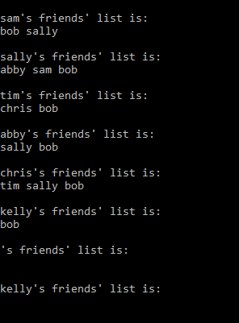

# Friend_List 
## Using C# _ Class Design: Person
* The Person class is intended to be an abstract and simplified representation of a person. Each person will have an array of “friends” – which are other “Person” instances.
* The main instance methods are: Add friend, Remove friend and display friend list. Friends can add each automatically (“bilateral” relationships)
* Friend's array list will be expanded automally to additonal 5 slots when it is full.

